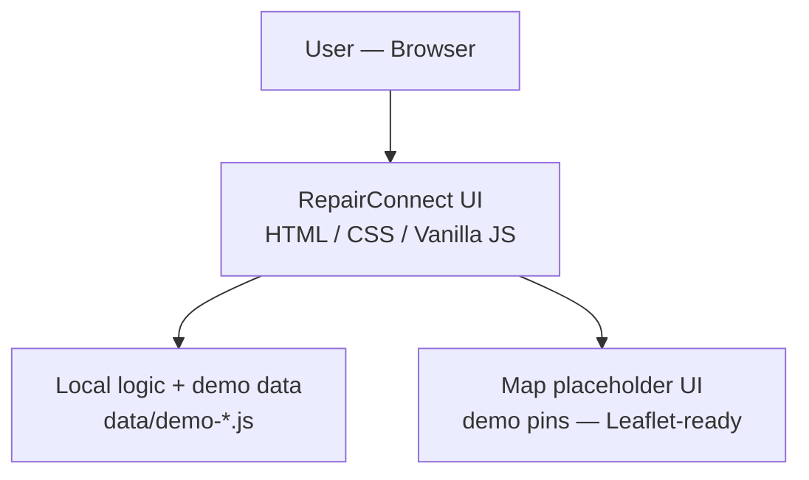
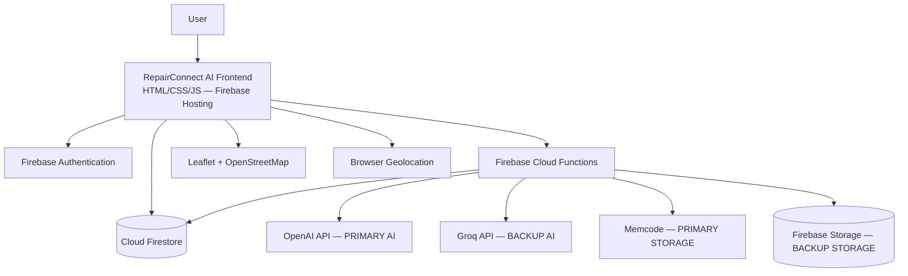
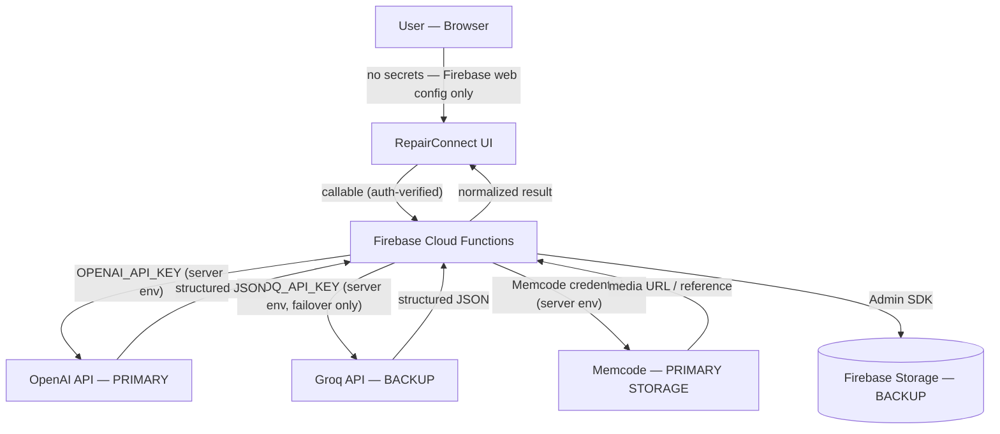

# RepairConnect AI — System Architecture

**Document:** ARCHITECTURE.md
**Status:** Frontend ✅ implemented · Auth/Firestore ✅ implemented (code) · **AI backend 🧩 implemented (code)** · Storage 🔮 later phase
**Last updated:** 2026-08-22

Single source of truth for how components connect. **Do not rebuild or change this architecture without approval** (Development Rule #1). Current vs. planned is labelled explicitly.

> **Phase status (this phase — secure AI backend):** the AI layer is **implemented in code and tested** — Cloud Functions `analyzeRepair` + `assistant` (OpenAI primary → Groq failover → normalize → deterministic recommendation → Firestore, with per-user rate limiting). It is **not verified live** because `OPENAI_API_KEY`/`GROQ_API_KEY` are not present in this workspace. Memcode + Firebase Storage backup remain a **later phase** (the current `analyzeRepair` flow accepts an image as base64 directly — no storage yet).

---

## 1. Current architecture (✅ IMPLEMENTED)



- 14 static pages, modular vanilla JS, design system.
- All flows run on **demo data** and clearly-labelled simulated behavior.
- **No backend, AI, storage, or real maps. No credentials.**

---

## 2. Planned production architecture (🟡 PLANNED)



### 2.1 Database architecture (planned)

```
Frontend → Firebase Authentication (uid) → Cloud Firestore
  → users / devices / diagnoses / repairRequests / repairers / repairStatusHistory / mediaReferences
```

### 2.2 Storage architecture (dual-layer — implemented in code; Memcode pending official docs)

**PRIMARY: Memcode · BACKUP: Firebase Storage · DATABASE: Firestore (metadata/references)**

Primary flow:

```
User → Frontend → Cloud Function / Secure Backend → Memcode → Stored media
                                                          ↓
                                                   media reference → Firestore
```

Backup flow:

```
Memcode → Backup process → Firebase Storage → Backup media → Firestore backup reference
```

> Firebase Storage is a **secondary backup/disaster-recovery layer**, not the default upload destination. Do not claim automatic backup until it is implemented.

### 2.3 AI architecture (planned — dual-provider failover)

**PRIMARY: OpenAI · BACKUP: Groq**

```
User → Frontend → Cloud Function → OpenAI API → structured response
                                       ↓ (if a defined fallback condition occurs)
                                     Groq API → structured response
                                                          ↓
                              normalize → consistent schema → Frontend
```

> The frontend does **not** know which provider produced a response. The Cloud Function normalizes both to one consistent schema.

### 2.4 Repairer discovery (planned)

```
User location → Browser Geolocation → Leaflet + OpenStreetMap → provider data (demo → real later)
  → deterministic matching/comparison → repair request → repair tracking (Firestore)
```

---

## 3. Data flows (planned, per feature)

### 3.1 Damage Analysis
- **This phase (implemented):** Frontend → `analyzeRepair` (image as base64 + optional text) → **OpenAI** (or **Groq** on failover) → structured JSON → validate/normalize → deterministic recommendation → Firestore `diagnoses` → UI.
- **Storage (implemented in code):** the image goes to **Memcode (PRIMARY, via `functions/lib/storage.js` adapter — official doc verification pending)** with an optional **Firebase Storage backup** (`BACKUP_ENABLED=true`), and a `mediaReferences` record is written to Firestore. Roles are never reversed: normal uploads hit the primary first; backup failure preserves the primary (`backupStatus: 'failed'`).

### 3.2 Repair Recommendation
Diagnosis + device info + deterministic estimate engine → repair-vs-replace verdict + explanation (AI explains only) → stored on the diagnosis → UI.

### 3.3 Repairer Discovery
User location → provider data → Haversine distance → deterministic ranking (Best Match) → UI.

### 3.4 Repair Request & Tracking
User → selected repairer → Firestore `repairRequests` + `repairStatusHistory` event → real-time status timeline → UI.

---

## 3.5 End-to-end journey wiring (✅ implemented — verified headless in demo mode)

The diagnosis id is propagated through the whole flow so every screen reads the
same record (Firestore live / demo fallback):

```
Analyze ──(analyzeRepair → diagnosisId)──▶ diagnosis.html?id={id}
   └── "Check Repairability" ──▶ repair-decision.html?id={id}
          └── "Find Repairers" ──▶ repairers.html?diagnosis={id}
                 ├── provider "Request Repair" ──▶ request-repair.html?provider={pid}&diagnosis={id}
                 └── compare ──▶ request-repair.html?provider={pid}&diagnosis={id}
                        └── success ──▶ tracking.html?id={requestId}
```

- `js/diagnosis.js` / `js/repair-decision.js` load the diagnosis by `?id=` via `RC.data.getDiagnosis()` (normalizing both demo and Firestore shapes).
- `js/repairers.js` / `js/compare.js` carry the `diagnosis` param forward to the request page.
- `js/repair-request.js` resolves the diagnosis for the summary, persists the **real** `diagnosisId` (not a hardcoded demo id), prevents duplicate submissions, and links the success state to `tracking.html?id={requestId}`.
- `js/dashboard.js` links the active repair to its tracking page.

## 4. Module / Code Organization (✅ implemented)

| Module | Responsibility | Status |
|---|---|---|
| `js/firebase-init.js` | Firebase SDK init (public config only) | 🟡 Planned (not created) |
| `js/auth.js` | Demo auth UI (simulated; Firebase Auth later) | ✅ Demo |
| `js/analyze.js` | Upload UI + simulated analysis | ✅ Demo |
| `js/diagnosis.js` | Renders structured diagnosis (demo data) | ✅ Demo |
| `js/repair-decision.js` | Renders repair-vs-replace (demo data) | ✅ Demo |
| `js/repairers.js` | Map placeholder + demo providers + Best Match | ✅ Demo |
| `js/compare.js`, `js/repair-request.js`, `js/tracking.js`, `js/assistant.js`, `js/dashboard.js` | Flow screens on demo data | ✅ Demo |
| `js/ui.js`, `js/navigation.js`, `js/animate.js`, `js/app.js` | Shared UI/nav/animation/bootstrap | ✅ Implemented |

---

## 5. Architecture Principles (binding)

1. **Keep the frontend simple** — no framework, no build step.
2. **Keep secrets server-side** — OpenAI, Groq, and Memcode credentials never reach the browser. All configuration is centralized in `.env` / `.env.example` (see [`API_CONFIGURATION.md`](API_CONFIGURATION.md)).
3. **Minimize dependencies** — Leaflet is the only planned third-party frontend library.
4. **Modular JavaScript** — one module per feature area.
5. **Validate all external input** — uploads, forms, AI responses.
6. **Handle failures gracefully** — error/empty/loading states everywhere.
7. **Never trust AI output** — server validates/normalizes JSON.
8. **Keep AI output structured** — one consistent schema for both providers (AI_SPEC.md).
9. **Free-first** — no paid services (TECH_STACK.md).
10. **Preliminary labeling** — AI diagnosis always labelled preliminary.
11. **Transparent recommendations** — verdicts and Best Match are deterministic.
12. **Primary + backup separation** — Memcode primary / Firebase Storage backup; OpenAI primary / Groq backup.

---

## 6. API security architecture (credential boundaries)



| Boundary | Rule |
|---|---|
| Browser ↔ Cloud Function | Only user content; never secrets. |
| Cloud Function ↔ OpenAI / Groq | Keys from server env only; Groq used on failover. |
| Cloud Function ↔ Memcode | Credential server-side; verify official docs. |
| Cloud Function ↔ Firebase Storage | Backup only; Admin SDK + Storage Rules. |
| Cloud Function ↔ Browser | Only validated, normalized data returns. |
| Frontend ↔ Firestore | Auth + Firestore Rules (not "hidden config"). |
| Frontend ↔ Leaflet/OSM | No keys; OSM attribution policy. |
| Frontend ↔ Geolocation | Browser permission; coarse location. |

Full per-service detail: **API_SERVICES.md**.

---

## 7. Failure & degradation strategy

| Failure | Behavior |
|---|---|
| OpenAI fails / malformed JSON | Defined fallback → Groq; otherwise typed error + retry. |
| Both AI providers fail | User-friendly error; no broken references; safe logging (no credential leakage). |
| Memcode upload fails | Report failure; **no invalid Firestore reference**; allow retry; Firebase Storage fallback only if implemented. |
| Backup (Firebase Storage) fails after Memcode success | Keep primary reference; mark `backupStatus`; allow retry; do **not** tell the user the primary upload failed. |
| Geolocation denied | Manual search / "show all" fallback. |
| Firestore rule rejects write | Permission error surfaced; rules verified. |
| Map tiles offline | List view still works. |
