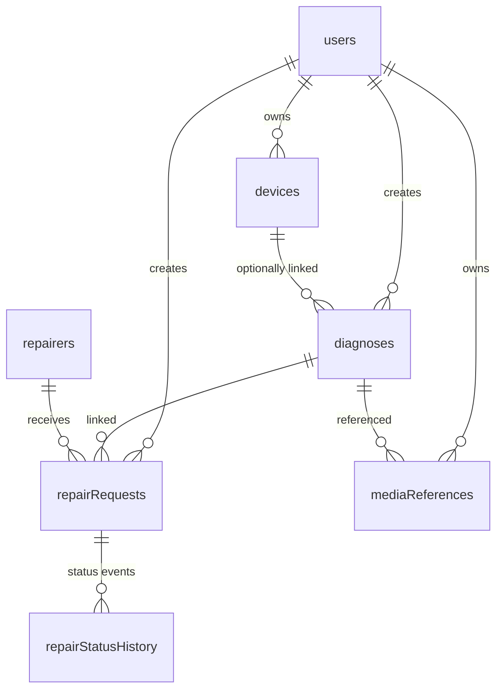

# RepairConnect AI — Database Schema (Cloud Firestore)

**Document:** DATABASE_SCHEMA.md
**Status:** PLANNED FIRESTORE SCHEMA (not yet created — no Firestore collections exist in the current project)
**Last updated:** 2026-08-22

This document defines the **planned** Firestore data model. **No collections currently exist** — the frontend runs entirely on demo data (`data/`). Field types use Firestore types: `string`, `number`, `boolean`, `array`, `map`, `timestamp`, `geopoint`.

> **Media storage note:** large files (images/videos) are **not** stored in Firestore. They live in **Memcode (PRIMARY STORAGE)** with **Firebase Storage as BACKUP** (both planned); Firestore stores only references/metadata via the `mediaReferences` collection.

---

## 1. Collection overview

---

## 2. `users`

**Purpose:** one document per authenticated user.

| Field | Type | Required | Description |
|---|---|---|---|
| `uid` | string | ✅ | Document ID = Firebase Auth UID. |
| `name` | string | ✅ | Display name. |
| `email` | string | ✅ | Email (lowercased). |
| `photoURL` | string | ⬜ | Avatar URL. |
| `preferences` | map | ⬜ | `{ emailNotifications: boolean, smsUpdates: boolean, sustainabilityTips: boolean }` |
| `createdAt` | timestamp | ✅ | Creation (server timestamp). |

**Indexes:** none beyond default.

---

## 3. `devices`

**Purpose:** saved devices for reuse across diagnoses and requests.

| Field | Type | Required | Description |
|---|---|---|---|
| `deviceId` | string | ✅ | Auto ID. |
| `userId` | string | ✅ | Owner UID. |
| `category` | string | ✅ | `smartphone`, `laptop`, `tablet`, `desktop`, `tv`, `home_appliance`, `wearable`, `audio`, `camera`, `other`. |
| `brand` | string | ⬜ | e.g. "Dell". |
| `model` | string | ⬜ | e.g. "XPS 13". |
| `ageYears` | number | ⬜ | Age in years (e.g. 2.5). |
| `purchasePrice` | number | ⬜ | Original price (₹). |
| `createdAt` | timestamp | ✅ | Creation. |

**Indexes:** composite `(userId, createdAt DESC)`.

---

## 4. `diagnoses`

**Purpose:** the structured result of one AI analysis + (after recommendation) the deterministic repair-vs-replace result.

| Field | Type | Required | Description |
|---|---|---|---|
| `diagnosisId` | string | ✅ | Auto ID. |
| `userId` | string | ✅ | Owner UID. |
| `deviceId` | string | ⬜ | Linked device. |
| `mediaReferences` | array<string> | ⬜ | IDs into `mediaReferences` (the uploaded image/video). |
| `detectedIssue` | string | ✅ | Free-text damage summary, e.g. "Cracked display". |
| `detectedDevice` | string | ✅ | Free-text device identification. |
| `severity` | string | ✅ | `minor`, `moderate`, `major`, `severe` (displayed Low/Medium/High/Critical). |
| `confidence` | number | ✅ | 0.0–1.0 (displayed %). |
| `possibleCauses` | array<map> | ✅ | `{ text: string, kind: "visible" \| "inferred" }`. |
| `troubleshooting` | array<map> | ✅ | `{ step: string, safetyNote?: string }`. |
| `warnings` | array<string> | ✅ | Safety/limitation warnings. |
| `professionalInspectionAdvised` | boolean | ✅ | True when deferring to a professional. |
| `repairEstimate` | map | ⬜ | `{ min, max, currency }` — deterministic estimate engine. |
| `replacementEstimate` | map | ⬜ | `{ value, currency }`. |
| `recommendation` | map | ⬜ | `{ verdict, decisionScore, repairCostRatio, explanation }` (deterministic; AI explains only). |
| `createdAt` | timestamp | ✅ | Analysis time. |

**Indexes:** composite `(userId, createdAt DESC)`.

---

## 5. `repairers`

**Purpose:** repair professionals shown on the map and in comparison. **Demo data today; real data later (if approved).**

| Field | Type | Required | Description |
|---|---|---|---|
| `repairerId` | string | ✅ | Auto ID. |
| `name` | string | ✅ | Business name. |
| `location` | geopoint | ✅ | Coordinates. |
| `categories` | array<string> | ✅ | Categories served. |
| `expertise` | array<string> | ⬜ | Specialties. |
| `rating` | number | ✅ | 0.0–5.0. |
| `estimatedPrice` | map | ✅ | `{ min, max, currency }`. |
| `estimatedTime` | string | ✅ | e.g. "1–2 days". |
| `availability` | string | ✅ | Hours. |
| `contact` | map | ⬜ | `{ phone, email?, website? }`. |

**Indexes:** none required initially (capped query + client sort); optional `categories` if server-side filtering.

---

## 6. `repairRequests`

**Purpose:** a user's repair request to a specific repairer.

| Field | Type | Required | Description |
|---|---|---|---|
| `requestId` | string | ✅ | Auto ID. |
| `userId` | string | ✅ | Requester UID. |
| `deviceId` | string | ⬜ | Linked device. |
| `diagnosisId` | string | ✅ | Source diagnosis. |
| `repairerId` | string | ✅ | Selected repairer. |
| `status` | string | ✅ | `submitted → accepted → received → diagnosis_confirmed → in_progress → ready_for_pickup → completed` (+ `declined`, `cancelled`). |
| `estimatedCost` | number | ✅ | ₹ captured at request time. |
| `notes` | string | ⬜ | Optional message. |
| `createdAt` | timestamp | ✅ | Request time. |
| `updatedAt` | timestamp | ✅ | Last status change. |

**Indexes:** composite `(userId, createdAt DESC)`; `(repairerId, status)`.

---

## 7. `repairStatusHistory` (top-level collection)

**Purpose:** append-only log of status changes — the single source of truth for tracking.

| Field | Type | Required | Description |
|---|---|---|---|
| `eventId` | string | ✅ | Auto ID. |
| `requestId` | string | ✅ | Owning `repairRequests` document id. |
| `status` | string | ✅ | The status reached in this event (same enum as `repairRequests.status`). |
| `changedBy` | string | ✅ | `user` \| `repairer` \| `system`. |
| `notes` | string | ⬜ | Optional note. |
| `timestamp` | timestamp | ✅ | Event time (server timestamp). |

**Consistency:** `repairRequests.status`/`updatedAt` mirror the latest event (written in one batch).

**Client-write scope (this phase):** clients may only create the **initial** `status: "submitted"` event (enforced by `firestore.rules`). All further transitions (`accepted → … → completed`) require the backend (Cloud Functions, later phase) — arbitrary client-side status changes are denied.

---

## 8. `mediaReferences`

**Purpose:** metadata/reference for uploaded media. **Primary storage = Memcode; backup storage = Firebase Storage.** Firestore never holds the binary.

| Field | Type | Required | Description |
|---|---|---|---|
| `mediaId` | string | ✅ | Auto ID. |
| `userId` | string | ✅ | Owner UID. |
| `type` | string | ✅ | `image` \| `video`. |
| `primaryProvider` | string | ✅ | `"memcode"`. |
| `primaryReference` | string | ✅ | Memcode object key/reference (per official docs — verified at integration). |
| `backupProvider` | string | ⬜ | `"firebase-storage"` (set when a backup copy exists). |
| `backupReference` | string | ⬜ | Firebase Storage path/reference of the backup copy. |
| `backupStatus` | string | ⬜ | `done` \| `failed` \| `not_applicable` \| `delete_failed` (partial deletion — reference retained for retry). |
| `url` | string | ⬜ | Resolved/signed URL if applicable. |
| `contentType` | string | ✅ | e.g. `image/jpeg`. |
| `sizeBytes` | number | ✅ | File size. |
| `createdAt` | timestamp | ✅ | Upload time. |
| `updatedAt` | timestamp | ⬜ | Last metadata change (e.g. backup status). |

> These are **conceptual fields** — the exact schema is finalized at integration once Memcode's official reference behavior is verified. **No collections are created during documentation.**

**Rules:** deletion of a diagnosis deletes its media references (and the underlying Memcode object and Firebase Storage backup where supported).

---

## 9. Query & index considerations (summary)

| Query | Index |
|---|---|
| My diagnoses | `(userId, createdAt DESC)` on `diagnoses` |
| My devices | `(userId, createdAt DESC)` on `devices` |
| My requests | `(userId, createdAt DESC)` on `repairRequests` |
| Repairer's jobs | `(repairerId, status)` on `repairRequests` |
| Status timeline | composite `(requestId ASC, timestamp ASC)` on `repairStatusHistory` |
| My media | `(userId, createdAt DESC)` on `mediaReferences` |

---

## 10. Data ownership & isolation (planned)

- Every private doc carries `userId`; rules enforce `request.auth.uid == userId`.
- `repairers` world-readable, not user-writable.
- `repairStatusHistory` is owner-scoped via its `requestId` → parent `repairRequests.userId` (checked in rules); clients may only append the initial `submitted` event.
- `mediaReferences` owner-scoped; underlying media protected via Memcode (per official docs).

Isolation is enforced by **Authentication + Firestore Security Rules + server-side validation** — never by hiding the Firebase web config (SECURITY.md §8).

---

## 11. Status

**PLANNED FIRESTORE SCHEMA** — none of these collections exist yet. The current frontend renders equivalent **demo data** (`data/demo-devices.js`, `data/demo-diagnoses.js`, `data/demo-repairers.js`) that mirrors this shape so the swap to Firestore is a data-source change, not a UI rewrite.
