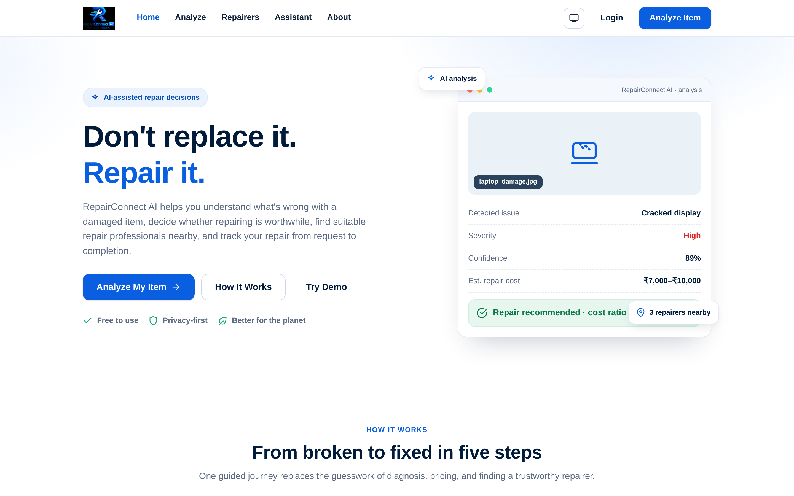
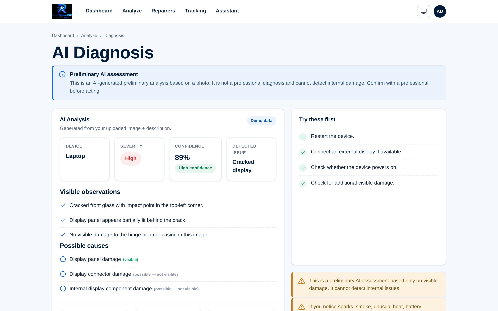
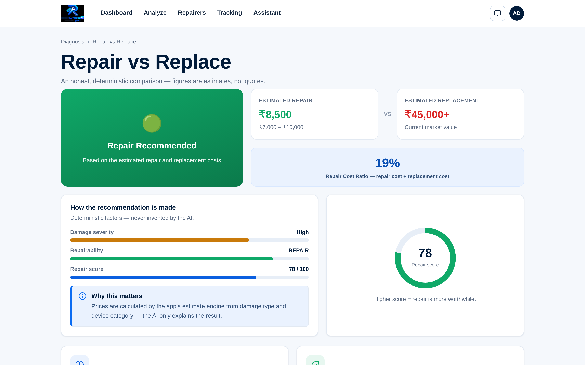
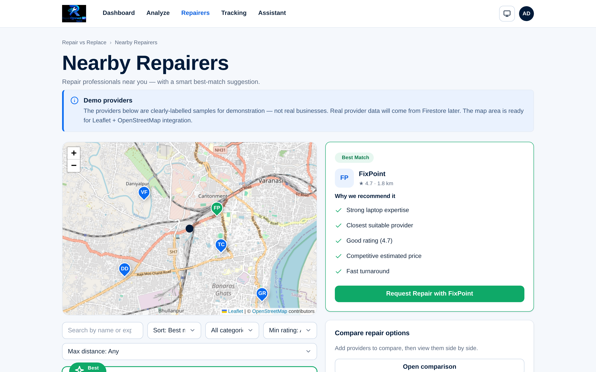
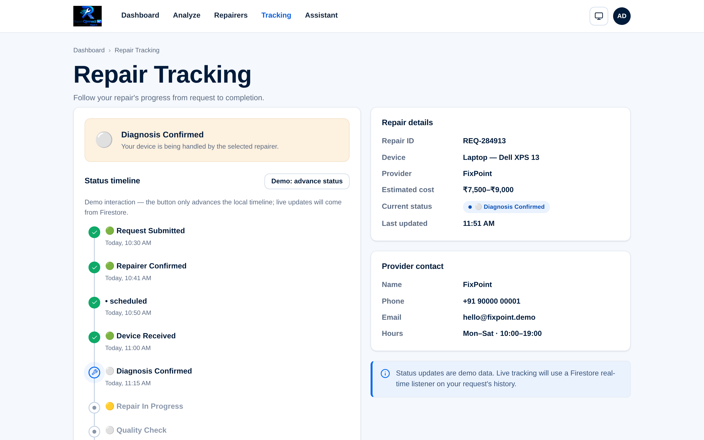
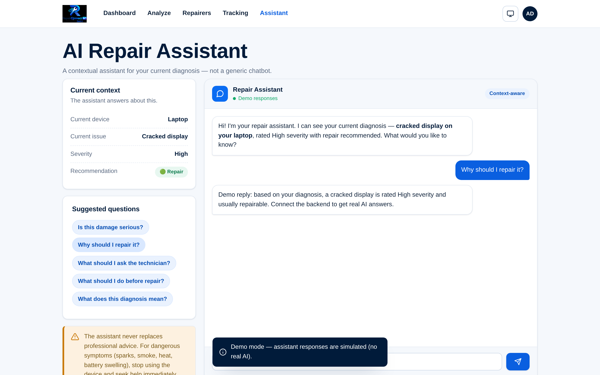

<<<<<<< HEAD
# RepairConnect AI

> AI-powered repair guidance that helps users understand device damage, evaluate repair options, and connect with repair solutions.

**Don't replace it. Repair it.**

=======
# 🔧 RepairConnect AI

**Don't replace it. Repair it.**

RepairConnect AI is an AI-powered repair decision and repair-connection platform. Upload a photo of a damaged item, understand what's wrong, decide whether repairing is worthwhile, find the right nearby repair professional, and track the repair to completion.

>>>>>>> 28c9ed7f1c972dcc2dd6035eba09b3a09345a356
**Live:** https://repairconnect-ai.vercel.app/ · **Source:** [github.com/somansinghal/RepairConnect-AI](https://github.com/somansinghal/RepairConnect-AI)


<<<<<<< HEAD
> **Status:** Hackathon MVP — the **complete frontend is implemented** (26 pages, responsive, light/dark theme, SEO, accessibility). **Firebase Auth, Firestore (+ Security Rules), and the secure AI backend (`analyzeRepair`/`assistant` — OpenAI primary → Groq failover) are implemented in code** but require real project credentials to run live. **Memcode (primary storage) is an adapter interface pending official-docs verification; Firebase Storage (backup) is implemented.** Leaflet + OpenStreetMap maps are live. See the status matrix below.
=======
> **Status:** Hackathon MVP — the **complete frontend is implemented**. **Firebase Auth, Firestore (+ Security Rules), and the secure AI backend (`analyzeRepair`/`assistant` — OpenAI primary → Groq failover) are implemented in code** and run on a clearly-labelled demo fallback until real project credentials are supplied. **Memcode / Firebase Storage backup are a later phase.** Leaflet/OSM maps are live. See the status matrix below.
>>>>>>> 28c9ed7f1c972dcc2dd6035eba09b3a09345a356

---

## 📸 Screenshots

### Landing Page


### AI Diagnosis


### Repair vs Replace


### Repairer Discovery


### Repair Tracking


### AI Assistant


Mobile previews are available in [`screenshots/mobile/`](screenshots/mobile/). Curated showcase set: [`screenshots/showcase/`](screenshots/showcase/).

## 🎥 Product Demo

<<<<<<< HEAD
Watch the full journey (demo data; recorded with a signed-in test session — no real accounts):

[▶ Download the demo recording](recordings/demo.webm) — Landing → Login → Analyze → Diagnosis → Repair vs Replace → Repairers → Comparison → Request → Tracking → Assistant → Dashboard.

## 🚀 Demo Access

Use these Firebase demo accounts to explore the app:
=======
Watch the full journey (demo data, no credentials):

[▶ Download the demo recording](recordings/demo.webm) — Landing → Analyze → Diagnosis → Repair vs Replace → Repairers → Comparison → Request → Tracking → Assistant → Dashboard.

## 🚀 Demo Access (for judges & reviewers)
>>>>>>> 28c9ed7f1c972dcc2dd6035eba09b3a09345a356

### Demo User
- **Email:** `demo@repairconnect.ai`
- **Password:** `RepairDemo123!`

### Demo Judge
- **Email:** `judge@repairconnect.ai`
- **Password:** `JudgeDemo123!`

<<<<<<< HEAD
> **⚠️ DEMO CREDENTIALS ONLY.** These are **intentionally public test accounts** shown on the login page's DEMO ACCESS block (where "Use Demo User" / "Use Demo Judge" fill the form). They are **not** production credentials — they must be created in **Firebase Console → Authentication → Users** to be active, are **normal user-level accounts only** (no admin privileges), and hold synthetic sample data only. Sign-in always goes through Firebase Authentication — there is no guest/demo bypass: app pages require authentication.

=======
> **Status: REQUIRES FIREBASE ACCOUNT SETUP.** These public test credentials are shown on the login page (with "Use Demo User" / "Use Demo Judge" buttons that auto-fill the form) and are **normal user-level accounts only** — they must be created in Firebase Authentication to be active. They have **no admin privileges** and hold only synthetic sample data. They are intentionally public test accounts; never grant them elevated access.

- **Quickest (no account):** click **"Try Demo"** / **"Explore demo without an account"** on the landing or login page — clearly-labelled sample data, no real account.
>>>>>>> 28c9ed7f1c972dcc2dd6035eba09b3a09345a356
- Demo providers (FixPoint, TechCare, Device Doctor, VoltFix, GreenRepair Hub) are **fictional** — not real businesses. The demo diagnosis is **simulated**, not real AI output.

---

<<<<<<< HEAD
## 🧩 Project Overview

**The problem:** when a device or household item breaks, most people don't know what's wrong, whether it's repairable, what it should cost, whether to repair or replace it, or who to trust to fix it. The result: consumers over-replace, over-spend, or abandon repairable items — and repairable goods end up as waste.

**What RepairConnect AI does:** it brings the entire repair journey into one platform:
=======
## 🧩 The Problem

When a device or household item breaks, most people don't know:

- What exactly is wrong, and how serious is it?
- Can it be repaired — and is it worth the money?
- How much might the repair cost?
- Should they repair it or replace it?
- Where can they get it fixed, and who is the best option?
- What happens after they hand the item over?

The result: consumers over-replace, over-spend, or abandon repairable items, while repairable goods end up as waste.

## 💡 The Solution

RepairConnect AI brings the entire journey into one platform:
>>>>>>> 28c9ed7f1c972dcc2dd6035eba09b3a09345a356

```
Broken item → Upload photo → AI analysis → Possible diagnosis → Safe troubleshooting
→ Repair cost estimate → Repair vs Replace → Find nearby repairers → Compare options
→ Request repair → Track status → Repair completed
```

<<<<<<< HEAD
- **AI-assisted repair analysis** — upload a photo (or describe the issue) and the AI identifies the device, the damage, possible causes, severity, and a confidence level.
- **Repair vs replacement** — a transparent verdict with a repair-cost ratio, decision score, and a plain-language explanation.
- **Repairer discovery** — map-based discovery (Leaflet + OpenStreetMap) with filters, a ⭐ Best Match ranking, and side-by-side comparison.
- **Repair tracking** — request a repair and follow a 7-step status timeline.
- **AI assistant** — a contextual assistant grounded in the current diagnosis (not a generic chatbot).

> ⚠️ All AI results are clearly labelled **preliminary**. The product never claims certainty about hidden damage and always recommends professional inspection where appropriate.

## ✨ Key Features

### Available (implemented)

- **AI damage analysis** — device + damage identification, possible causes, severity, confidence.
- **Image-based analysis** — drag-and-drop upload with client-side type/size validation (JPG/PNG/WebP up to 5 MB).
- **Safe basic troubleshooting** — non-destructive steps with explicit safety warnings.
- **Repair cost estimate** — a deterministic ₹ price band (not LLM-invented math).
- **Repair vs replace** — verdict, repair-cost ratio, decision score, plain-language explanation.
- **Repairer discovery** — Leaflet + OpenStreetMap live map, filters, Best Match, comparison.
- **Repair requests & tracking** — request submission + 7-step status timeline.
- **AI repair assistant** — contextual chat grounded in the diagnosis.
- **User dashboard** — devices, active repairs, repair history, saved AI reports.
- **User authentication** — Firebase email/password + Google sign-in (code implemented; requires Firebase setup), protected app pages, sign-out, session persistence, password reset.
- **Demo accounts** — two clearly-labelled test accounts (see [Demo Access](#-demo-access)).
- **Responsive UI** — mobile-first, 320 px → 3440 px (26 pages × 23 viewports audited).
- **Theme changer** — Light ⇄ Dark with system fallback.
- **Contact system** — `mailto:`-based contact page (no fake backend).
- **Legal pages** — Privacy, Terms, Cookie, Disclaimer, Security.
- **FAQ, Repair Guide, Sustainability** — public informational pages.
- **SEO** — canonical URLs, JSON-LD, `sitemap.xml`, `robots.txt`, Open Graph/Twitter cards.

### Planned

- Production repair-provider integrations (a real repairer data source).
- Full automated media-backup workflow (Memcode primary → Firebase Storage backup).
- Video damage analysis (conditional on model + storage support).
- Provider self-service, notifications, PDF reports.

---

## 🛠 Tech Stack

| Technology | Purpose |
|---|---|
| HTML5 | Application pages (26) |
| CSS3 | Styling, design system, responsive UI, themes |
| JavaScript (Vanilla, ES2017+) | Client-side functionality (no framework) |
| Firebase Authentication | User authentication (email/password + Google) — 🧩 code implemented |
| Cloud Firestore | Database: app data, metadata, media references — 🧩 code implemented |
| Firebase Cloud Functions | Secure backend (AI bridge, storage, rate limiting) — 🧩 code implemented |
| **Memcode** | **PRIMARY media storage** — 🧩 adapter interface (docs verification pending) |
| Firebase Storage | **BACKUP media storage** — 🧩 code implemented (opt-in) |
| **OpenAI API** | **PRIMARY AI provider** (server-side) — 🧩 code implemented (key required) |
| **Groq API** | **BACKUP AI provider** (failover only) — 🧩 code implemented (key required) |
| Leaflet | Maps (vendored 1.9.4) — ✅ implemented |
| OpenStreetMap | Map tile data — ✅ implemented |
| Browser Geolocation | Approximate user location — ✅ implemented |
| Vercel | Static hosting + HTTPS + security headers (`vercel.json`) |

**Free-first:** everything targets free/free-tier services. **No service is assumed permanently free** (verify at integration).

---
=======
It's a complete repair ecosystem — **not** a chatbot, not a static shop directory, not a bare image classifier.

## ✨ Key Features

- **AI Damage Analysis** — upload a photo (or describe the issue) and get device + damage identification, possible causes, severity, and a confidence level.
- **Safe Basic Troubleshooting** — non-destructive steps with explicit safety warnings. Never dangerous electrical/high-voltage instructions.
- **Repair Cost Estimate** — a deterministic ₹ price band (not LLM-invented math).
- **Repair vs Replace** — a transparent verdict with a repair-cost ratio, decision score, and plain-language explanation.
- **Smart Repair Matching** — a ⭐ Best Match ranking across distance, price, rating, expertise, and turnaround.
- **Nearby Repairers** — map-based discovery (Leaflet + OpenStreetMap ready) with filters and a side-by-side comparison.
- **Repair Requests & Tracking** — submit a request and follow a 7-step status timeline.
- **AI Repair Assistant** — a contextual assistant grounded in the current diagnosis (not a generic chatbot).
- **User Dashboard** — devices, active repairs, previous repairs, and saved AI reports.

> ⚠️ All AI results are clearly labelled **preliminary**. The product never claims certainty about hidden damage and always recommends professional inspection where appropriate.

## 🛠 Tech Stack

| Purpose | Technology |
|---|---|
| Frontend | HTML5 · CSS3 · Vanilla JavaScript (no frameworks) — ✅ implemented |
| Authentication | Firebase Authentication — 🧩 code implemented (deploy + config required) |
| Database | Cloud Firestore — 🧩 code implemented (deploy required) |
| File / media storage — PRIMARY | **Memcode** — 🧩 adapter interface (official docs verification pending) |
| File / media storage — BACKUP | **Firebase Storage** — 🧩 code implemented (deploy required) |
| Server / API bridge | Firebase Cloud Functions — 🧩 code implemented (deploy required) |
| AI — PRIMARY | **OpenAI API** (server-side only) — 🧩 code implemented (key required) |
| AI — BACKUP | **Groq API** (failover only) — 🧩 code implemented (key required) |
| Maps | Leaflet + OpenStreetMap — ✅ implemented (live map + geolocation) |
| Hosting | Vercel-ready (`vercel.json`); Firebase Hosting optional |

**Free-first:** everything targets free/free-tier services — ₹0 implementation cost. **No service is assumed permanently free** (verify at integration).

> **Credentials:** `OPENAI_API_KEY` (primary AI) and `GROQ_API_KEY` (backup AI) plus any Memcode credential are server-side secrets — never in the frontend. The Firebase web config is public-ish and protected by Security Rules. All configuration is centralized in `.env` (gitignored) / `.env.example` (committed). Full variable reference: [API_CONFIGURATION.md](API_CONFIGURATION.md) — service catalog: [API_SERVICES.md](API_SERVICES.md) — env-var placeholders: [`.env.example`](.env.example).
>>>>>>> 28c9ed7f1c972dcc2dd6035eba09b3a09345a356

## 🏗 Architecture

```
User (browser)
  ↓
<<<<<<< HEAD
Static HTML/CSS/JS (Vercel / Firebase Hosting)
  ├── Firebase Authentication ── session / uid
  ├── Cloud Firestore ────────── data + media references
  ├── Cloud Functions ──────────> OpenAI API  (PRIMARY AI, server-side key)
  │                             └─> Groq API   (BACKUP AI, failover, server-side key)
=======
Static HTML/CSS/JS (Firebase Hosting)
  ├── Firebase Authentication ── session / uid
  ├── Cloud Firestore ────────── data + media references
  ├── Cloud Functions ──────────> OpenAI API  (PRIMARY AI, server-side key)
  │                             └─> Groq API  (BACKUP AI, failover, server-side key)
>>>>>>> 28c9ed7f1c972dcc2dd6035eba09b3a09345a356
  ├── Cloud Functions ──────────> Memcode           (PRIMARY storage)
  │                             └─> Firebase Storage (BACKUP storage)
  └── Leaflet + OpenStreetMap ── maps
```

- **Secrets stay server-side** — the OpenAI and Groq keys (and any Memcode credential) live only in Cloud Functions secrets, never in the frontend.
- **Deterministic logic** — cost estimates, repair-vs-replace, and Best Match ranking are app-side calculations; the AI only *explains* them.
<<<<<<< HEAD

### 🗄 Storage architecture

- **Memcode = PRIMARY MEDIA STORAGE** — normal destination for new uploads (damaged-item images, supported videos, repair-related media). Adapter interface in `functions/lib/storage.js`; pending official-docs verification.
- **Firebase Storage = BACKUP MEDIA STORAGE** — secondary disaster-recovery layer for backup copies (*never* the default upload destination). Implemented via the Admin SDK, disabled by default (`BACKUP_ENABLED=false`).
- **Cloud Firestore = database** — application data, user-related records, diagnosis/repair information, repair history, and media **metadata + references** (`mediaReferences`). **Large media files are never stored in Firestore.**

> The primary/backup roles are **never reversed**.

### 🤖 AI architecture

- **Primary AI:** OpenAI API — damage analysis, diagnosis, and assistant responses.
- **Backup AI:** Groq API — used only on defined failover conditions (timeout / 429 / 5xx / network; 4xx never fails over).
- **Secure backend:** Firebase Cloud Functions normalizes both providers into one consistent structured response — the frontend never depends on a provider-specific format.

---

## 🔐 Authentication

- **Provider:** Firebase Authentication (email/password, with Google OAuth prepared in code).
- **Email/password login** — `signInWithEmailAndPassword()`; signup via `createUserWithEmailAndPassword()`.
- **Google OAuth** — `GoogleAuthProvider` + `signInWithPopup` (code implemented; requires enabling the Google provider in Firebase Console, otherwise a clear "not configured" message is shown).
- **Protected application pages** — `dashboard`, `analyze`, `diagnosis`, `repair-decision`, `repairers`, `compare`, `request-repair`, `tracking`, `assistant`, `profile` redirect unauthenticated visitors to `login.html?next=<page>`.
- **Session handling** — Firebase `onAuthStateChanged()` with a loading overlay (safety-capped, never hangs), remember-me persistence (LOCAL vs SESSION), and real Firebase `signOut()`.
- **Demo accounts** — see [Demo Access](#-demo-access) (**DEMO CREDENTIALS ONLY**).
- No passwords are compared or stored in JavaScript, `localStorage`, `sessionStorage`, or Firestore — Firebase Authentication handles verification. Frontend route protection is UX only; Firestore/Storage Security Rules remain the real boundary.

---

## 🔑 Environment Configuration

Configuration is centralized in `.env` (gitignored) / `.env.example` (committed). **Variable names only — never real values — are documented here:**

```env
# PRIMARY AI — OpenAI (server-side only)
OPENAI_API_KEY=
OPENAI_VISION_MODEL=

# BACKUP AI — Groq (server-side only)
GROQ_API_KEY=
GROQ_VISION_MODEL=

# Firebase web config (public-ish — NOT a secret)
FIREBASE_API_KEY=
FIREBASE_AUTH_DOMAIN=
FIREBASE_PROJECT_ID=
FIREBASE_STORAGE_BUCKET=
FIREBASE_MESSAGING_SENDER_ID=
FIREBASE_APP_ID=

# Demo account (demo-only)
JUDGE_DEMO_EMAIL=
JUDGE_DEMO_PASSWORD=

# Backend (server-side)
ANALYZE_DAILY_LIMIT=
BACKUP_ENABLED=
```

> Optional server-side overrides: `OPENAI_BASE_URL`, `GROQ_BASE_URL`. **Memcode** variable names are added only after verifying the official Memcode documentation (none are assumed). Full variable → file → function reference: [API_CONFIGURATION.md](API_CONFIGURATION.md).
=======
- Full specifications live in the Markdown documents listed in [Documentation](#-documentation).

### 🗄 Storage architecture

- **Primary storage:** Memcode (normal destination for new uploads)
- **Backup storage:** Firebase Storage (secondary disaster-recovery layer — *not* the default upload destination)
- **Database:** Cloud Firestore (metadata + `mediaReferences` — not large binaries)

### 🤖 AI architecture

- **Primary AI:** OpenAI API
- **Backup AI:** Groq API (used only on defined failover conditions)
- **Secure backend:** Firebase Cloud Functions normalizes both providers to one consistent structured response — the frontend never depends on a provider-specific format.
>>>>>>> 28c9ed7f1c972dcc2dd6035eba09b3a09345a356

## 🧭 How It Works

1. **Upload** a photo of the damaged item (or describe it).
2. **Diagnose** — AI identifies the issue, causes, severity, and safe next steps.
3. **Decide** — compare estimated repair vs replacement cost.
4. **Find** — discover and compare nearby repair professionals.
5. **Repair** — request a repair and track it to completion.

<<<<<<< HEAD
---

=======
>>>>>>> 28c9ed7f1c972dcc2dd6035eba09b3a09345a356
## 📁 Project Structure

```
repairconnect-ai/
├── index.html            # landing page (public)
├── about.html            # about (public)
├── contact.html          # contact page (public)
├── how-it-works.html     # full journey (public)
├── features.html         # feature overview (public)
├── faq.html              # FAQ (public)
├── repair-guide.html     # safety-first repair guide (public)
├── sustainability.html   # sustainability (public)
├── privacy-policy.html   # privacy policy (public)
├── terms-of-service.html # terms of service (public)
├── cookie-policy.html    # cookie policy (public)
├── disclaimer.html       # AI & repair disclaimer (public)
├── security.html         # security page (public)
<<<<<<< HEAD
├── login.html            # login (DEMO ACCESS block)
├── signup.html           # signup
├── dashboard.html        # user dashboard (protected)
├── analyze.html          # damage upload + analysis (protected)
├── diagnosis.html        # AI diagnosis (protected)
├── repair-decision.html  # repair vs replace (protected)
├── repairers.html        # nearby repairers + map (protected)
├── compare.html          # side-by-side comparison (protected)
├── request-repair.html   # repair request (protected)
├── tracking.html         # repair tracking (protected)
├── assistant.html        # AI repair assistant (protected)
├── profile.html          # profile (protected)
├── 404.html              # branded 404
├── css/                  # global, components, pages, animations, theme, footer, legal, …
├── js/                   # modular vanilla JS (one module per feature)
├── data/                 # demo data layer (→ Firestore later)
├── functions/            # Cloud Functions (index.js) + lib/ (ai, estimate, guard, normalize, prompts, storage)
├── vendor/               # Firebase compat SDK + Leaflet (no CDN dependency in production)
├── assets/images/        # official logo, favicon, OG image
├── scripts/              # screenshots, recording, audit, unit/auth tests, Firebase test double (dev only)
├── screenshots/          # desktop + mobile + showcase images
├── recordings/           # demo journey video (demo.webm)
├── firestore.rules       # owner-scoped, default-deny Firestore rules
├── storage.rules         # backup-only Storage rules
├── vercel.json           # Vercel config + security headers + rewrites
├── sitemap.xml · robots.txt · google43d334ab82b2aeee.html
=======
├── login.html            # login (UI)
├── signup.html           # signup (UI)
├── dashboard.html        # user dashboard
├── analyze.html          # damage upload + analysis
├── diagnosis.html        # AI diagnosis
├── repair-decision.html  # repair vs replace
├── repairers.html        # nearby repairers + map
├── compare.html          # side-by-side comparison
├── request-repair.html   # repair request
├── tracking.html         # repair tracking
├── assistant.html        # AI repair assistant
├── profile.html          # profile
├── css/                  # global, components, pages, animations, theme, footer, legal
├── vercel.json           # Vercel config + security headers
├── js/                   # modular vanilla JS (one module per feature)
├── data/                 # demo data layer (→ Firestore later)
├── assets/images/        # official logo, favicon, OG image
├── scripts/              # screenshots, recording, audit tooling (dev only)
├── screenshots/          # desktop + mobile + showcase images
├── recordings/           # demo journey video (demo.webm)
├── sitemap.xml
├── robots.txt
>>>>>>> 28c9ed7f1c972dcc2dd6035eba09b3a09345a356
├── .env.example          # placeholder env vars (safe to commit); real values go in gitignored `.env`
├── API_CONFIGURATION.md  # variable → service → file → function reference
└── package.json          # dev tooling only (Playwright)
```

<<<<<<< HEAD
---

## 🔌 Backend setup (Firebase Auth + Firestore + secure AI + storage)

The backend is **implemented in code** and unit-tested, but it needs your project's credentials to run live. Until configured, protected pages redirect to Login and every auth/AI action fails with a clear, friendly message — no fake success is shown.

1. **Firebase project** — create one (Spark/free plan), enable **Authentication (email/password)**, **Cloud Firestore**, **Storage** (backup bucket), and **Functions**. Add the production domain **`repairconnect-ai.vercel.app`** to **Authentication → Settings → Authorized domains**.
2. **Frontend config** — paste your web config into `js/firebase-config.js` (`RC_CONFIG.firebase`). This is public-ish config; security comes from Rules, not from hiding it.
3. **Demo accounts** — create `demo@repairconnect.ai` and `judge@repairconnect.ai` in **Firebase Console → Authentication → Users** with the passwords shown in [Demo Access](#-demo-access) (normal user-level only).
4. **Security rules** — deploy `firestore.rules` and `storage.rules` (`firebase deploy --only firestore:rules,storage`).
5. **Cloud Functions** — `cd functions && npm install`, set secrets, then `firebase deploy --only functions`:
=======
## 🔌 Backend setup (Firebase Auth + Firestore + secure AI + storage)

The backend is **implemented in code** and unit-tested, but it needs your project's credentials to run live. Until configured, the site runs on the clearly-labelled **demo fallback** — no fake success is shown.

1. **Firebase project** — create one (Spark/free plan), enable **Authentication (email/password)**, **Cloud Firestore**, **Storage** (backup bucket), and **Functions**.
2. **Frontend config** — paste your web config into `js/firebase-config.js` (`RC_CONFIG.firebase`) — or inject it at deploy time. This is public-ish config; security comes from Rules, not from hiding it.
3. **Security rules** — deploy `firestore.rules` and `storage.rules` (`firebase deploy --only firestore:rules,storage`).
4. **Cloud Functions** — `cd functions && npm install`, set secrets, then `firebase deploy --only functions`:
>>>>>>> 28c9ed7f1c972dcc2dd6035eba09b3a09345a356
   ```bash
   firebase functions:secrets:set OPENAI_API_KEY
   firebase functions:secrets:set GROQ_API_KEY
   ```
   Callable endpoints: **`analyzeRepair`** (store image → AI analysis), **`assistant`**, **`deleteMedia`** — OpenAI primary → Groq failover, server-side normalization, deterministic recommendation, per-user rate limiting (`ANALYZE_DAILY_LIMIT`, default 20). Enable **Firebase App Check** for stronger abuse protection.
<<<<<<< HEAD
6. **Storage** — **Memcode = PRIMARY** (adapter in `functions/lib/storage.js`; implement it against the official Memcode docs once verified). **Firebase Storage = BACKUP**: set `BACKUP_ENABLED=true` to copy files after a successful primary upload (backup failure never invalidates the primary). Roles are never reversed.

---
=======
5. **Storage** — **Memcode = PRIMARY** (adapter in `functions/lib/storage.js`; implement it against the official Memcode docs once verified). **Firebase Storage = BACKUP**: set `BACKUP_ENABLED=true` to copy files after a successful primary upload (backup failure never invalidates the primary). Roles are never reversed.
6. **Judge Demo** — create a Firebase user `judge@repairconnect.ai` with synthetic sample data, and set its password via the `JUDGE_DEMO_PASSWORD` env var (injected into `RC_CONFIG.judgeDemo` at deploy). The login page's **Judge Demo** button only activates once that credential is configured.

> Environment variable names (placeholders only): `OPENAI_API_KEY`, `OPENAI_VISION_MODEL`, `GROQ_API_KEY`, `GROQ_VISION_MODEL`, `FIREBASE_*` web config, `JUDGE_DEMO_EMAIL`, `JUDGE_DEMO_PASSWORD`, `BACKUP_ENABLED`, plus Memcode's exact official names (post-verification). See [`.env.example`](.env.example) and [`functions/.env.example`](functions/.env.example).
>>>>>>> 28c9ed7f1c972dcc2dd6035eba09b3a09345a356

## 🚀 Local Setup

The site is plain HTML/CSS/JS — no build step.

```bash
# Serve locally (any static server works)
npm run serve          # → http://localhost:8080
# or just open index.html in a browser
```

<<<<<<< HEAD
Generate showcase screenshots / recording and run tests (Playwright — dev tooling only, not shipped to production):
=======
Generate showcase screenshots / recording (Playwright — dev tooling only, not shipped to production):
>>>>>>> 28c9ed7f1c972dcc2dd6035eba09b3a09345a356

```bash
npm install
npx playwright install chromium
# Linux may also need: sudo npx playwright install-deps chromium
<<<<<<< HEAD

=======
>>>>>>> 28c9ed7f1c972dcc2dd6035eba09b3a09345a356
npm run screenshots          # desktop (1440×900) + mobile (390×844)
npm run screenshots:desktop  # desktop only
npm run screenshots:mobile   # mobile only
npm run record               # demo journey video → recordings/demo.webm
<<<<<<< HEAD
npm run audit                # responsive / console / a11y audit (26 pages × 23 viewports)
npm run test:unit            # backend unit tests (normalize, estimate, failover, storage)
npm run test:auth            # auth behavior tests (no-bypass, demo buttons, route protection)
=======
npm run audit                # responsive / console / a11y audit
npm run test:unit            # backend unit tests (normalize/estimate/failover)
>>>>>>> 28c9ed7f1c972dcc2dd6035eba09b3a09345a356
```

### ⚖️ Legal & contact

<<<<<<< HEAD
Five public legal pages are included — [Privacy Policy](privacy-policy.html), [Terms of Service](terms-of-service.html), [Cookie Policy](cookie-policy.html), [Disclaimer](disclaimer.html), and [Security](security.html) — plus a [Contact](contact.html) page (**Soman Singhal** — email · LinkedIn · GitHub · portfolio). The contact form composes a `mailto:` to the project's real address (no email backend — nothing is faked).
=======
Five public pages are included — [Privacy Policy](privacy-policy.html), [Terms of Service](terms-of-service.html), [Cookie Policy](cookie-policy.html), [Disclaimer](disclaimer.html), and [Security](security.html) — plus a [Contact](contact.html) page (**Soman Singhal** — email · LinkedIn · GitHub · portfolio). The contact form composes a `mailto:` to the project's real address (no email backend — nothing is faked).
>>>>>>> 28c9ed7f1c972dcc2dd6035eba09b3a09345a356

### ☀️ Theme (Light / Dark / System)

Every page has a theme toggle in the header. It is a reliable **two-state Light ⇄ Dark** switch (with an initial **System** fallback that follows `prefers-color-scheme` until you choose). Preference is stored in `localStorage`, applied before first paint (`js/theme-init.js`) to avoid flashing, cross-fades on switch (respecting `prefers-reduced-motion`), and keeps the browser `theme-color` meta in sync.

### ▲ Vercel deployment

The site is static — deploy the project root on Vercel as-is (Framework preset: **Other** / no build step). `vercel.json` ships:

- **Clean URLs** — `/analyze`, `/dashboard`, `/repairers`, `/tracking`, `/assistant`, `/about`, `/privacy`, etc. rewrite to their `.html` pages (the existing `.html` routes keep working too).
- **Security headers** — Content-Security-Policy (`frame-ancestors 'self'` clickjacking protection, `object-src 'none'`), `X-Content-Type-Options`, `Referrer-Policy`, `Permissions-Policy`, `Strict-Transport-Security`, `X-Frame-Options`.
- **Caching** — HTML `must-revalidate`; `/assets`, `/css`, `/js`, `/screenshots`, `/recordings` cached with stale-while-revalidate.
- **Branded 404** — `404.html` is served automatically for unknown routes.

HTTPS is provided automatically by Vercel.

<<<<<<< HEAD
> **CSP note:** `script-src 'unsafe-inline'` is required only for the inline JSON-LD structured data and the no-flash `document.documentElement.classList.add('js')` line; `style-src 'unsafe-inline'` is required for inline `style=""` attributes used by the renderers. Image/connect sources allow OpenStreetMap tiles for the Leaflet map.
=======
> **CSP note:** `script-src 'unsafe-inline'` is required only for the inline JSON-LD structured data and the no-flash `document.documentElement.classList.add('js')` line; `style-src 'unsafe-inline'` is required for inline `style=""` attributes used by the renderers. Image/connect sources allow OpenStreetMap tiles for the future Leaflet map.
>>>>>>> 28c9ed7f1c972dcc2dd6035eba09b3a09345a356

### 🛡 Error handling

A global error handler (`js/errors.js`) catches unexpected errors and unhandled promise rejections and shows a generic toast — never stack traces, paths, or secrets. Screens have their own empty/error/retry states (e.g. the diagnosis screen shows a friendly "couldn't load" state with a retry CTA if data is missing).

<<<<<<< HEAD
---

=======
>>>>>>> 28c9ed7f1c972dcc2dd6035eba09b3a09345a356
## 🔮 Future Improvements (backend stage)

- Wire **Firebase Auth**, **Firestore**, **Cloud Functions**, and **Hosting** (integration seams already in place).
- Integrate **Memcode** (primary) + **Firebase Storage** (backup) media storage (verify official docs first).
- Connect **OpenAI** (primary) via the `analyzeRepair` / `assistant` Cloud Functions, with **Groq** failover (models verified at build time).
<<<<<<< HEAD
- Real repairer data source (only if explicitly approved); video damage analysis; PDF reports; provider self-service; notifications.

---
=======
- Real repairer data source (only if explicitly approved); Leaflet + OSM live map + browser geolocation.
- Video damage analysis (conditional on model + storage support); PDF reports; provider self-service; notifications; dark mode.
>>>>>>> 28c9ed7f1c972dcc2dd6035eba09b3a09345a356

## 📊 Current Status

| Area | Status |
|---|---|
<<<<<<< HEAD
| Frontend (26 pages, design system, animations, SEO, a11y, responsive) | ✅ Implemented |
| Demo data + simulated flows (authenticated via Firebase) | ✅ Implemented / 🎭 Demo |
| Screenshot + recording + test tooling | ✅ Implemented |
=======
| Frontend (14 pages, design system, animations, SEO, a11y) | ✅ Implemented |
| Demo data + simulated flows + "Try Demo" | ✅ Implemented / 🎭 Demo |
| Screenshot + recording system | ✅ Implemented |
>>>>>>> 28c9ed7f1c972dcc2dd6035eba09b3a09345a356
| Firebase Auth · Firestore · Functions | 🧩 Code implemented — deploy + config required |
| Memcode storage (PRIMARY) | 🧩 Adapter interface — official docs verification pending |
| Firebase Storage (BACKUP) | 🧩 Code implemented — deploy required |
| OpenAI AI (PRIMARY) | 🧩 Code implemented — key required |
| Groq AI (BACKUP) | 🧩 Code implemented — key required |
| Leaflet · OSM · Geolocation | ✅ Implemented (live map) |
| Real repair-provider API | ⚪ Not selected |

<<<<<<< HEAD
---

=======
>>>>>>> 28c9ed7f1c972dcc2dd6035eba09b3a09345a356
## 📚 Documentation

- [PROJECT_SPEC.md](PROJECT_SPEC.md) — product spec, user journey, feature tiers, success criteria, development rules.
- [TECH_STACK.md](TECH_STACK.md) — exact technology choices and rationale.
- [ARCHITECTURE.md](ARCHITECTURE.md) — system architecture and data flows.
- [DATABASE_SCHEMA.md](DATABASE_SCHEMA.md) — Firestore collections, fields, indexes.
- [AI_SPEC.md](AI_SPEC.md) — AI responsibilities, structured output, safety, deterministic logic.
<<<<<<< HEAD
- [API_SERVICES.md](API_SERVICES.md) — every API/SDK/service, credential location, and implementation status.
- [API_CONFIGURATION.md](API_CONFIGURATION.md) — environment-variable reference (name → service → file → function).
=======
- [API_SERVICES.md](API_SERVICES.md) — every API/SDK/service, credential location, env vars, and implementation status.
>>>>>>> 28c9ed7f1c972dcc2dd6035eba09b3a09345a356
- [UI_UX_SPEC.md](UI_UX_SPEC.md) — screens, design system, states.
- [SECURITY.md](SECURITY.md) — key handling, rules, upload/input security, privacy.
- [BUILD_PLAN.md](BUILD_PLAN.md) — 6-hour implementation plan and priorities.

> **Production:** live at **https://repairconnect-ai.vercel.app/** · source on **GitHub** — [github.com/somansinghal/RepairConnect-AI](https://github.com/somansinghal/RepairConnect-AI). Canonical URLs, `og:image`, `sitemap.xml`, and `robots.txt` all reference the production domain.

<<<<<<< HEAD
---

=======
>>>>>>> 28c9ed7f1c972dcc2dd6035eba09b3a09345a356
## 📄 License

[MIT](LICENSE) — built for the RepairConnect hackathon (Problem Statement #10).
